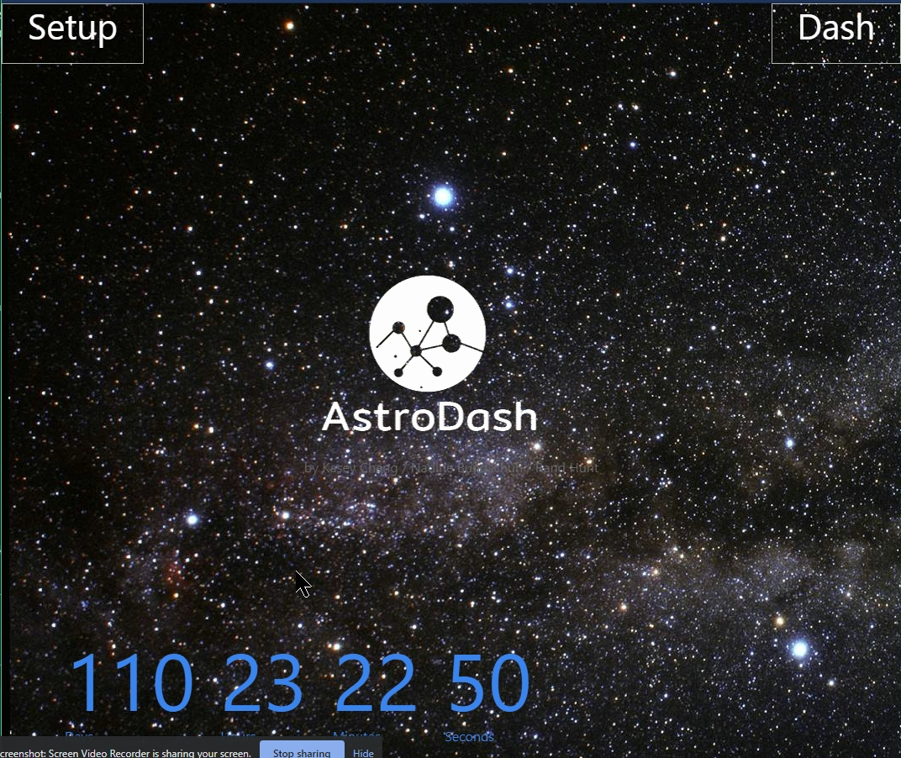
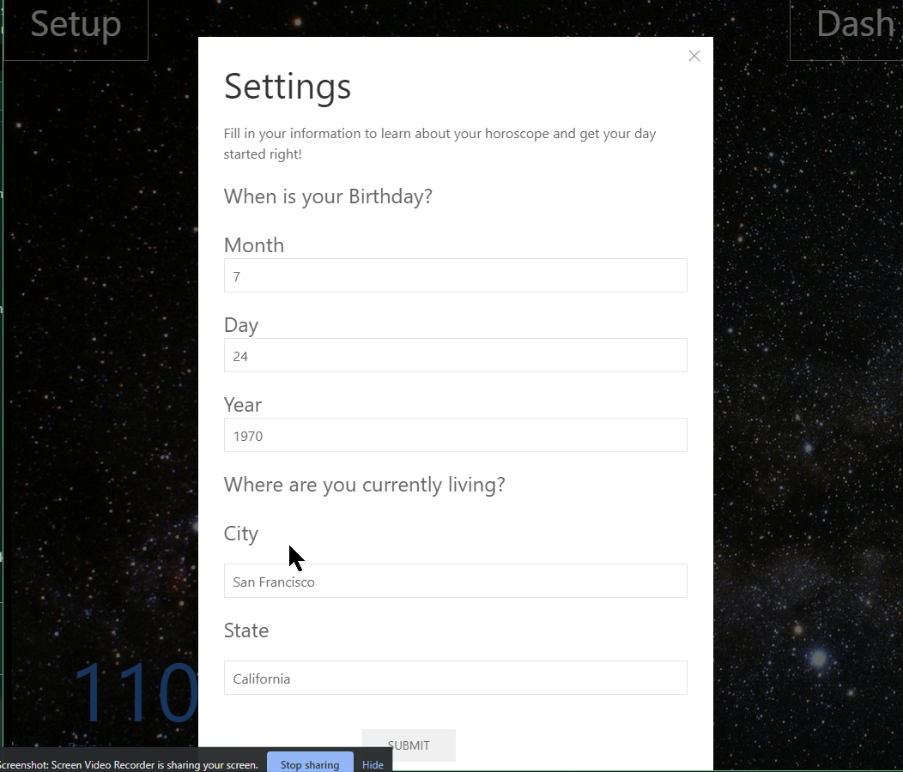
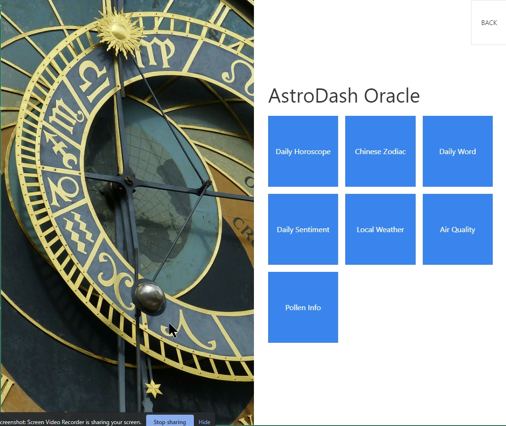
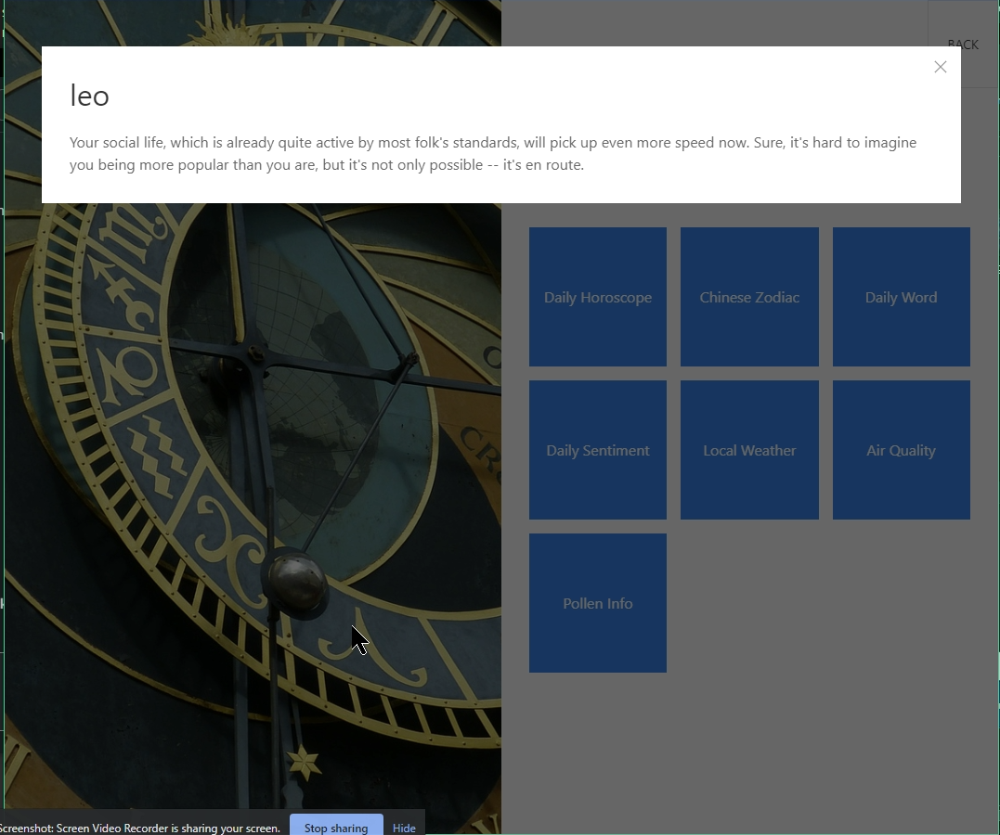

# astro-dash

AstroDash is a daily morning dashboard that will allow the user to setup with birthday and location (city and state) so it can fetch horoscope, Chinese Zodiac, Daily Word, Sentiment, (both extracted from horoscope), Local Whether, Air Quality Index, and Pollen Info through the use of several APIs.

## Notable features

- Modal dialogs using UIKit
- Extensive use of third-party API
- Random background (out of 6)
- Setup values are saved into localstroage and reused
-

## Project Repo

https://github.com/kschang77/astrodash2

## Deployed Link

https://kschang77.github.io/astrodash2/

## Screenshots

## AstroDash was built with...

[Javascript](https://developer.mozilla.org/en-US/docs/Web/JavaScript) -- general use

[jQuery](https://jquery.com/) -- general use

[UIKit](https://getuikit.com/) -- overall UI

[OpenWeather API -- weather info](https://openweathermap.org/api)

[Moment.js (general date functions)](https://momentjs.com/)

[Moment-lunar (Chinese zodiac calculation)](https://github.com/Luavis/moment-lunar)

[Dandelion API (sentiment and keyword)](https://dandelion.eu/docs/)

[Breezometer API (air quality and pollen)](https://breezometer.com/)

## Interesting Code Snippet

After checking various code snippets to calculate Chinese zodiac, most of them are wrong 1/10th of the time. The simple algorithms simply use the year for determination, neglecting to account for the year start difference. Lunar new year generally start in February of solar year, so people who are born between Jan 1 and Lunar New Year (aka Chinese New Year) will have the WRONG Chinese Zodiac with the simple algorithm. To get an accurate result, I had to write my own.

There are two approaches to take: either I can build a giant lookup table that contain the different start and end dates for each lunar new year, and the corresponding signs... Or I can locate a solar to lunar (and back) conversion library, use that to calculate the lunar year of the birthdate, then calculate the Chinese zodiac from that.

After a bit of checking, I was able to locate moment-lunar, a plug-in that added onto the Moment.js library to allow it to do solar and lunar date conversions. The following snippet shows how clean the code is, and it's 100% accurate.

       function chineseZodiac(indate) {
            // using moment.js and moment-lunar.js

            var zodiacTable = [
              "Monkey",
              "Rooster",
              "Dog",
              "Pig",
              "Rat",
              "Ox",
              "Tiger",
              "Rabbit",
              "Dragon",
              "Snake",
              "Horse",
              "Goat",
            ];

            //convert date into lunar date
            var tlunar2 = moment(indate).lunar().format("YYYY-MM-DD");

            var tlunarYear = moment(tlunar2).year();

            tsign = zodiacTable[tlunarYear % 12];

            return tsign;
     }

## The secret history of AstroDash

### At the Beginning...

Originally, this was supposed to be a graphical parcel tracking app where I pull a parcel's tracking info, and graph them on a map API. However, when Rand objected rather vociferously for not having any input on the matter, Nadine and I decided to look over our old project ideas to see if there's anything he liked. And after going through 7-8 ideas, he seems to like Astrological Dashboard, and thus, AstroDash is born.

The original design of AstroDash was to pull multiple horoscopes from disparate sources, then run a keyword and sentiment analysis on all of them to see if they actually agree overall, or are they more like... random?

However, after several hours checking each and every Horoscope API listed at ProgrammableWeb (NOT RapidAPI as indicated in the presentation) we found, to our dismay, that there are only 10 or so potentially usable ones, and all but two of them require registration and is only free for two weeks. While that would be within the project's timeframe, we decided to pass. One of those claimed to be free with registration, but when my attempt to register resulted in an "Error 500" webpage, clearly that's out as well.

Of the remaining two, one was an "unofficial API" (i.e. dubious legality). We passed on that one as well.

With only one API left to use, clear the idea was a no-go. And we had to pivot quickly. We decided to keep the dashboard idea and just add more function tiles, with only one horoscope, but attempt to wrestle a bit more meaning out of it with the sentiment and keyword analysis.

### The Pivot

At this point, it was clear that Rand wanted to play with the UI, and I'm better at the backend. Nadine acted as a go-between and technical writer. However, there really was no specifications. In fact, I didn't know what the app was going to look like until... Thursday. I can work on the backend and experiment with the AJAX calls, but basically, ALL of the button integration was done Friday morning, started at 3AM, just before the presentation.

And what I got was a mess. There were ZERO functionality except the buttons make a modal dialog pop up. And that's it. None of the dialog had any content. Only some of the dialog have ID for info pushing. And none of Rand's proposed features, such as a timer that counts down to the birthday (lower left corner) and the randomized background were working.

And as I have received ZERO briefing about UIKit, I had to solve my own problems. Fortunately, they are rather small.

### The Marathon Session

Over the next 7 hours I managed to fix most of Rand's bugs and implement the features properly, as well as hook in the various APIs and functions.

- Setup Modal Box, save input to localStorage -- by 0409
- Random background -- fixed at 0455
- Astrological sign, horoscope, Chinese Zodiac, Daily Word, and Daily Sentiment integration -- done at 0546
- Integrated Rand's logo- inverted into the app -- 0829
- All APIs integrated -- about 1049 (yes, I was programming while watching other teams present their stuff)

After the class is over I fixed the logo with true transparency. So it doesn't look like a glob of black in the middle.

## Stretch Goals / Future Development

The setup does not quite work. One of the merges seems to have broken it, or somewhere between 3AM and now I screwed it up.

Despite pleading both members to look into adding validation to the setup form for the entire week, while I work on the main logic, nothing was done.

Some advice on the Chinese Zodiac could be added. Right now, it just tells you what Chinese zodiac you are. Haven't found an API for that yet.

The lower left countdown is now a muted gray instead of proper white, and I can't figure out why. I turned it cyan for slightly better contrast, but it seems to be a uikit problem.

The proposed Giphy button, the generated playlist, or the moon-phase button was never implemented. There are two buttons hidden at this time that may be utilized.

## Author

**Kasey Chang**

- [Link to Github](https://github.com/kschang77)
- [Link to LinkedIn](https://www.linkedin.com/in/kasey-chang)

## License

This project is licensed under the MIT License

## Acknowledgments

- Hat tip to Nandine, Rant for teamwork, and Jerome, Kerwin, Mahi, and the UCBEx Coding Bootcamp March 2020 cohort
